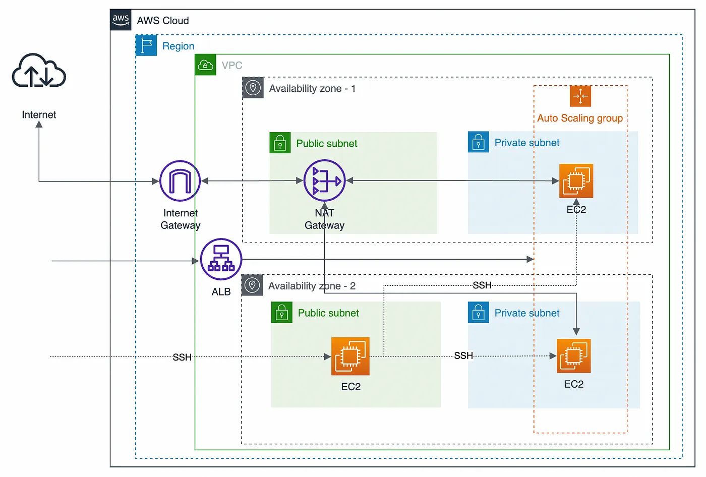
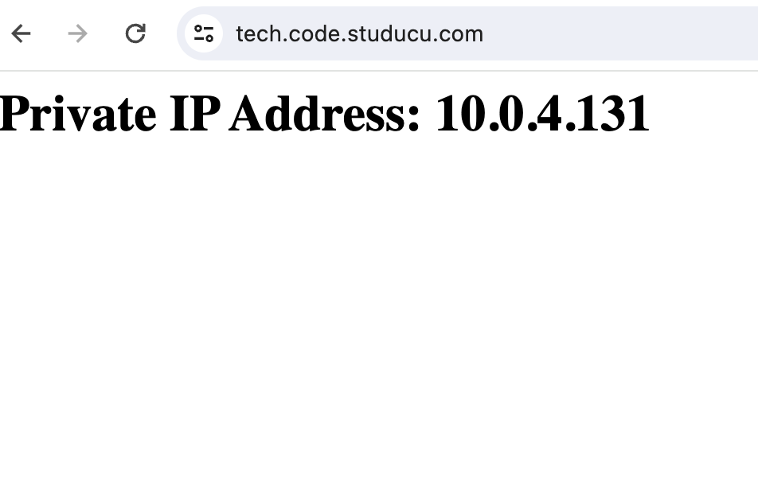
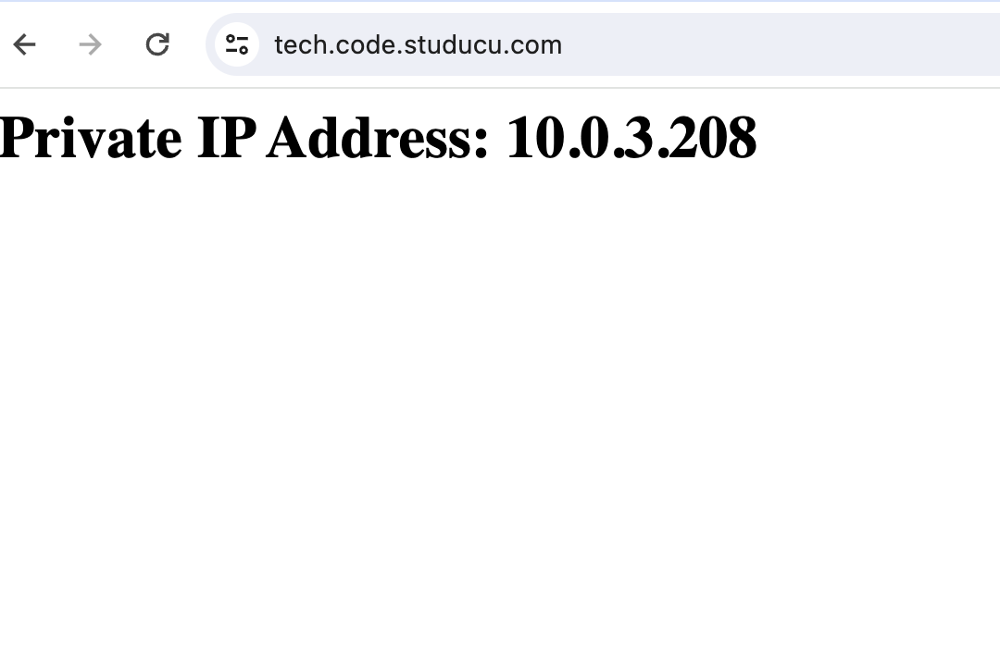

AWS Website Infrastructure with VPC ec2 ACM Certificate route53 and ALB

## Overview

This Terraform configuration sets up a basic infrastructure on AWS, including an ACM (Amazon Certificate Manager) certificate and an internal Application Load Balancer (ALB). The goal is to serve a website with a fully qualified domain name (FQDN) over HTTPS, backed by two private EC2 instances for redundancy.



## End results




## Terraform Configuration

### Prerequisites

1. *Terraform:*
   Ensure you have Terraform installed on your local machine. You can download it from [Terraform Downloads](https://www.terraform.io/downloads.html).

2. *AWS Credentials:*
   Configure your AWS credentials using the AWS CLI or by setting the AWS_ACCESS_KEY_ID and AWS_SECRET_ACCESS_KEY environment variables.

### Execution Steps

1. *Clone the Repository:*
   ```bash
   git clone https://github.com/Iyad87/tech-assignment.git
   cd tech-assignment
### Initialize Terraform:
1. change dir to root folder
```bash
 cd root
 terraform init
```
2. Apply the Terraform Configuration:

```bash
terraform apply
```

During the terraform apply step, Terraform will prompt you to confirm the changes. If you're sure, type yes and press Enter.
Access the Website:
After Terraform applies the configuration, the ALB DNS name will be output as website_url. Visit this URL in your browser to see the website.
Clean Up (Optional):
To destroy the infrastructure and associated resources:
```bash
terraform destroy
```

Type yes when prompted to confirm.
Customization
Domain Name:
Sub_Domain:
Update the domain_name in main.tf to your desired domain.
Region and Availability Zones:
Adjust the region and azs variables in main.tf based on your preferred AWS region and availability zones.
### ACM Certificate:
If you have a specific ACM certificate ARN, replace the default value in terraform.tfvars.
Output
The ALB DNS name will be output as website_url. Visit this URL to access the website.
Important Notes

### AWS Credentials:
Ensure your AWS credentials have sufficient permissions to create and manage the required resources.
ACM Certificate Validation:
ACM certificates may require DNS validation.
 Ensure you have control over the DNS records for the specified domain.
## Security Considerations:
This configuration sets up an internal ALB for enhanced security.
 Review and adjust security settings based on your requirements.
